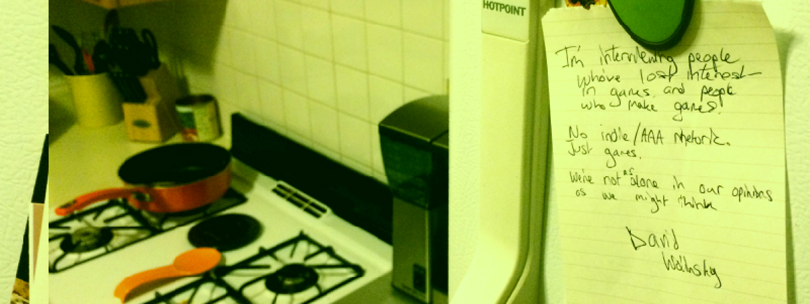

# Don't Die Prototype

*By G/A Augustin, Yifei Chen, Jennie Lee, Proud Taranat, and Harvey Zheng*



This repository is a demo of the interview page for our redesign of [Don't Die](https://nodontdie.com/). Built in React.js, this demo features a sample interview with a text size changer, as well as a color changer component.

## Installation

To download the repo, run:

```git clone https://github.com/harvzheng/dont-die.git && cd dont-die```

After, to install the necessary components run:

```npm install```

To run the site with Gatsby, use

``` npm run start```

## Components

The repository features a component, found in `components/color.js`

To use it, use:
`<ColorChanger color1="#FFFFFF" color2="#000000"/>`

where `color1` is the color of the background, and `color2` is the color of the text.
